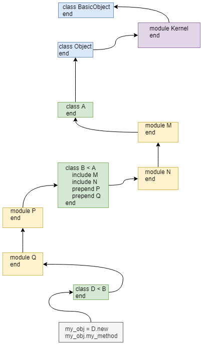

## Chapter 4

*Difference b/n class and module*

<details>
<summary>Answer</summary>

- Module cannot be instantiated.
- Modules are usually used for defining a set of behaviors or namespacing
</details>

*What's a mixin*

<details>
<summary>Answer</summary>

- Using module instead of class hierarchy to get some behavior

</details>

*Common convention for naming class and module*

<details>
<summary>Answer</summary>

- class Noun
- module Adjective

</details>

*The method look up path*

<details>
<summary>Answer</summary>




</details>

*How passing arguments to *super* works*

<details>
<summary>Answer</summary>

- super - all arguments are passed to parent
- super() - no arguments are passed
- super(a,b) - only the passed arguments go.

</details>

*Store a method into a variable and call it later *

<details>
<summary>Answer</summary>

```ruby
class A
    def yo
        puts "yo Dawg!!!"
    end
end
a = A.new
yo_method = a.method(:yo)
yo_method.call
```

</details>

*Traverse up the class hierarchy and get the top level method*

<details>
<summary>Answer</summary>

```ruby
class A
    def say
        "Say A"
    end
end

class B < A
    def say
        "Say B"
    end
end

class C < B
    def say
        "Say C"
    end
end

class D < C
    def say
        "Say D"
    end
end

top_level = nil
cur = D.new.method(:say)
while(cur.super_method)
    top_level = cur.super_method
    cur = cur.super_method
end
top_level.call if top_level
# Say A

```

</details>

*Signature of method_missing*

<details>
<summary>Answer</summary>

```ruby
# m - method name in symbol
# args - agum
def method_missing(m, *args)
    puts "the method name #{m} is not found"
    pust "the passed arguments are #{args}"
end
```

</details>

*Override method_missing at class level so the the following class responds to the message Person.list_all_with_hobbies(p) and Person.list_all_with_friends(p)*

```ruby
class Person
    PEOPLE = []
    attr_reader :name, :hobbies, :friends
    def initialize(name)
        @name = name
        @hobbies = []
        @friends = []
        PEOPLE << self
    end
    def has_hobby(hobby)
        @hobbies << hobby
    end
    def has_friend(friend)
        @friends << friend
    end
end
```

<details>
<summary>Answer</summary>

```ruby

def Person.method_missing(m, *args)
    method_name = m.to_s
    if method_name.starts_with("list_all_with_")
        public_attribute = method_name.split("_").last
        if Person.public_method_defined?(public_attribute)
            PEOPLE.find_all do |p|
                p.send(public_attribute).include?(args[0])
            end
        else
            raise "Can't find the attribute #{public_attribute}"
        end
    else
        super
    end
end
```

</details>

*module vs class*

<details>
<summary> Answer </summary>

**Module**

- Modules don’t have instances.
- It follows that entities or things are generally best modeled in classes, while characteristics, shared behaviors, and properties of entities or things are best encapsulated in modules. 
- class names tend to be nouns, whereas module names are often, but not always, adjectives (Stack versus Stacklike).

**Class**

- A class can have only one superclass, but it can mix in as many modules as it wants—If you’re using inheritance, give priority to creating a sensible superclass/subclass relationship. 
- Don’t use up a class’s one and only superclass relationship to endow the class with what might turn out to be just one of several sets of characteristics.

</details>

>From the standpoint of an Object, it doesn't really care how it got the method. All it cares is whether it can respond to a message based on the method lookup chain.